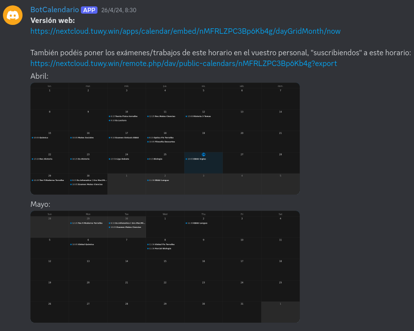

<h1>WallaReq</h1>

## Que es?

Sencillamente un bot de discord, el cual permite a los usuario atraves de un slash command, añadir eventos a un calendario, este calendario es el calendario de nextcloud.

El codigo fue un proyecto funcional, asi pues solo funciona con nextcloud y actualmente esta hardcode con mi url, pero es algo que proablemente cambie en poco.
Asi en el estado actual, si alguien necesitara alguna base para hacer un bot parecido puede usar este.
